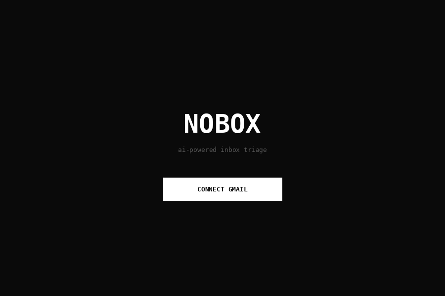
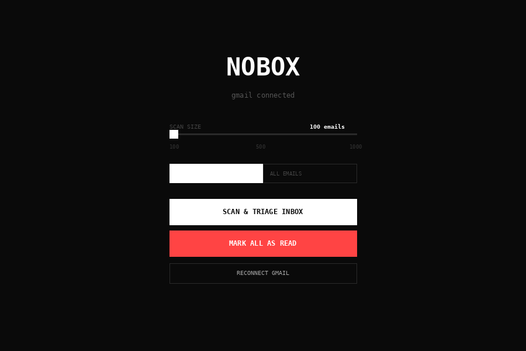
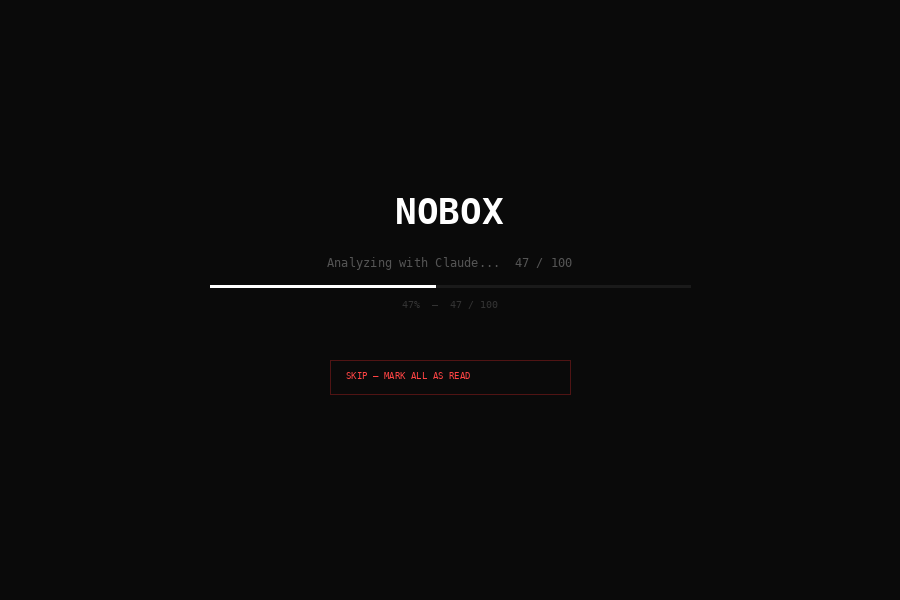
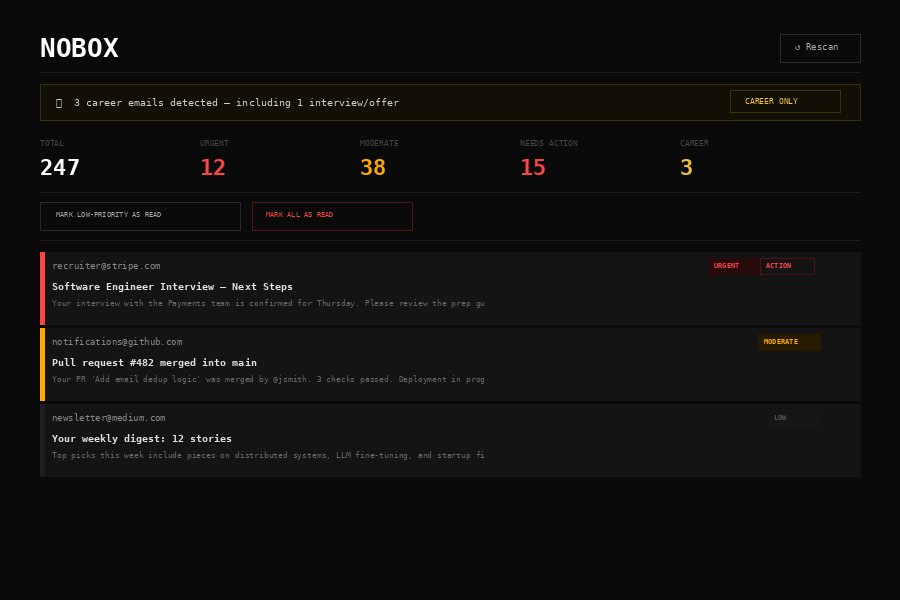

# NOBOX

> AI-powered Gmail inbox triage — built with React, Express, and Claude.

NOBOX connects to your Gmail account, scans your inbox, and uses Claude AI to prioritize every email by urgency, flag what needs action, and surface career-related messages automatically. The result is a clean, monospace dashboard that lets you see exactly what matters — and bulk-clear the rest in seconds.

---

## Screenshots

### 1. Connect Your Gmail
Sign in once with Google OAuth. Your tokens are saved locally so you don't have to reconnect on every visit.



---

### 2. Configure Your Scan
Choose how many emails to scan (100–1000) and whether to scan unread-only or all mail. You can also skip the AI triage and go straight to marking everything as read.



---

### 3. Live Scanning Progress
NOBOX streams progress in real time — first fetching emails from Gmail, then sending them through Claude for analysis. A live progress bar tracks both phases.



---

### 4. Triage Dashboard
Your inbox, triaged. Emails are ranked **urgent**, **moderate**, or **low** and flagged for action where needed. Career emails (job offers, interviews, recruiter outreach) are highlighted in gold with a dedicated filter.



---

## Features

- **OAuth Gmail integration** — read-only access, tokens stored locally
- **Claude AI triage** — every email is summarized, prioritized, and checked for required action
- **Career email detection** — automatically surfaces interviews, offers, and recruiter messages
- **Bulk mark-as-read** — clear low-priority mail or everything in one click, synced back to Gmail
- **Real-time streaming** — Server-Sent Events keep the UI updated as emails are processed
- **Minimal UI** — dark monospace design, no distractions

---

## Getting Started

### Prerequisites

- Node.js 18+
- A Google Cloud project with the Gmail API enabled
- An Anthropic API key

### Setup

1. **Clone the repo**

   ```bash
   git clone https://github.com/your-username/NoBox.git
   cd NoBox
   ```

2. **Install dependencies**

   ```bash
   npm install
   ```

3. **Create a `.env` file** in the project root:

   ```env
   GOOGLE_CLIENT_ID=your_google_client_id
   GOOGLE_CLIENT_SECRET=your_google_client_secret
   ANTHROPIC_API_KEY=your_anthropic_api_key
   ```

4. **Configure Google OAuth**

   In your Google Cloud Console, add `http://localhost:3175/auth/callback` as an authorized redirect URI.

5. **Run the app**

   ```bash
   npm run dev
   ```

   This starts both the Vite frontend (port 5175) and the Express API server (port 3175) concurrently. Open [http://localhost:5175](http://localhost:5175) in your browser.

---

## Project Structure

```
NoBox/
├── server/
│   └── index.js          # Express API — Gmail OAuth, email fetching, Claude calls
├── src/
│   ├── App.jsx           # App state machine (login → scan → dashboard)
│   ├── components/
│   │   ├── Dashboard.jsx # Triage dashboard with stats and filters
│   │   └── EmailCard.jsx # Individual email card component
│   └── index.css         # Monospace dark theme
├── index.html
└── vite.config.js
```

---

## How It Works

1. **Auth** — NOBOX uses Google OAuth 2.0 to get a refresh token for your Gmail account. Tokens are stored on disk so you only need to connect once.
2. **Fetch** — The Express server pulls emails from the Gmail API (subjects, senders, and body snippets), streaming progress to the frontend via Server-Sent Events.
3. **Triage** — Each email is sent to Claude with a structured prompt. Claude returns a priority level (`urgent` / `moderate` / `low`), a short summary, whether the email needs action, and whether it's career-related.
4. **Display** — The React frontend renders the triaged emails in a sortable dashboard. You can bulk-mark low-priority mail as read, or mark everything with one button.

---

## Built With

- [React](https://react.dev/) + [Vite](https://vitejs.dev/)
- [Express](https://expressjs.com/)
- [Google APIs Node.js Client](https://github.com/googleapis/google-api-nodejs-client)
- [Anthropic Claude SDK](https://github.com/anthropic-ai/anthropic-sdk-python)

---

## License

MIT
